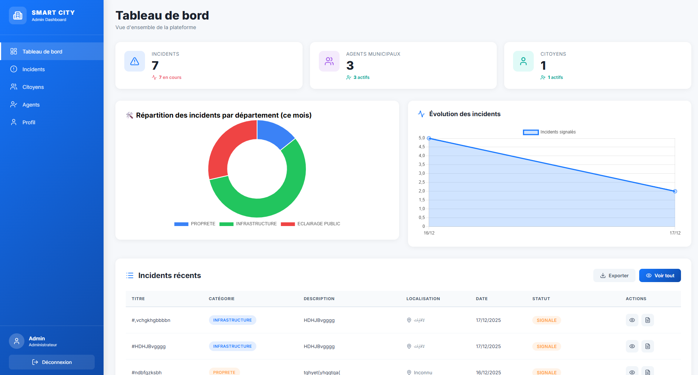
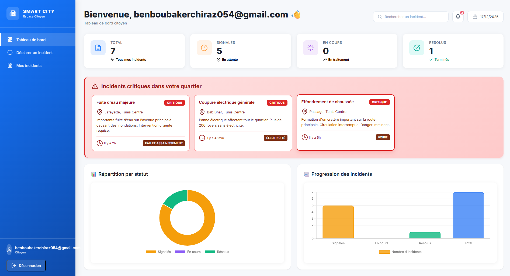
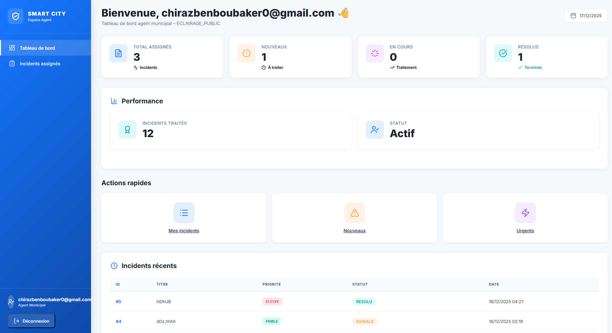
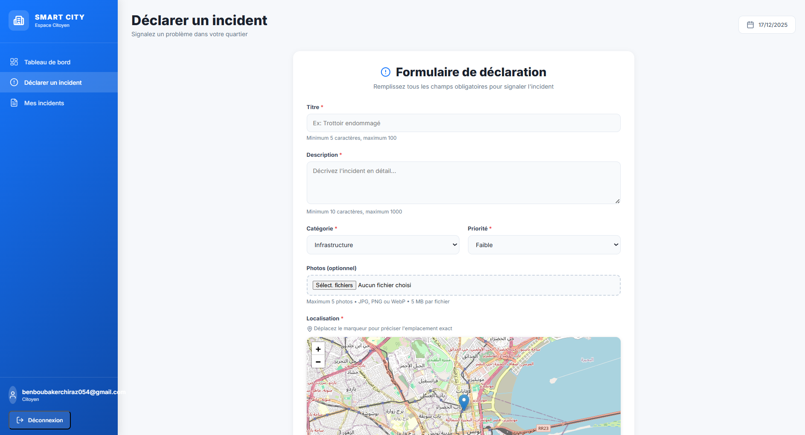

# 🏙️ Smart City - Gestion des Incidents Urbains

[](https://spring.io/projects/spring-boot)
[](https://www.postgresql.org/)
[](https://www.oracle.com/java/)

## 📋 Description

**Smart City** est une application web conçue pour améliorer la gestion des incidents urbains dans une ville intelligente. Elle permet aux citoyens de signaler en temps réel des problèmes quotidiens (nids de poule, lampadaires défectueux, déchets, fuites d'eau, signalisation défectueuse, etc.) et aux services municipaux de les traiter efficacement.

### 🎯 Objectifs
- ✅ Renforcer la réactivité des autorités locales
- ✅ Améliorer la qualité de vie des citoyens
- ✅ Collecter des données pour des analyses urbaines futures
- ✅ Assurer un suivi transparent des interventions

---

## 🚀 Fonctionnalités Principales

### 👤 Gestion des Utilisateurs
- **Inscription sécurisée** avec vérification d'email
- **Trois rôles** : Citoyen, Agent Municipal, Administrateur
- **Authentification robuste** avec Spring Security (BCrypt)

### 📢 Déclaration d'Incidents
- Formulaire intuitif avec description détaillée
- **Upload de photos** (jusqu'à 10MB)
- **Géolocalisation automatique** via Google Maps API
- **Catégorisation** (Infrastructure, Propreté, Sécurité, etc.)
- **Priorisation** (Basse, Moyenne, Élevée, Urgente)

### 🔄 Workflow des Incidents
Les incidents suivent un cycle de vie automatisé :
1. **Signalé** - Incident déclaré par un citoyen
2. **Pris en charge** - Assigné à un agent municipal
3. **En résolution** - Intervention en cours
4. **Résolu** - Travaux terminés et Feedback citoyen reçu
5. **Clôturé** - Travaux cloturé

### 📊 Tableaux de Bord
- **Citoyen** : Liste de ses incidents, statistiques personnelles
- **Agent** : Incidents assignés avec priorités
- **Admin** : Rapports analytiques complets, graphiques, exports PDF

### 🔍 Recherche et Filtrage
- Recherche avancée par statut, localisation, date, catégorie
- Pagination dynamique
- Filtres multiples (gouvernorat, ville, quartier)

### 📧 Notifications
- **Emails automatiques** via Spring Mail (Gmail SMTP) :
  - Alertes pour les agents (nouvelles assignations)
  - Confirmations d'actions
  - Création des comptes d'agents municipeaux

### ⭐ Système de Feedback
- Notation de 1 à 5 étoiles
- Commentaires optionnels


---

## 🛠️ Technologies Utilisées

### Backend
- **Framework** : Spring Boot 4.0.0
- **Sécurité** : Spring Security (BCrypt, CSRF protection)
- **Persistance** : Spring Data JPA / Hibernate
- **Base de données** : PostgreSQL 17
- **Validation** : Jakarta Validation
- **Email** : Spring Mail (Gmail SMTP)

### Frontend
- **Moteur de templates** : Thymeleaf
- **CSS** : CSS personnalisé 
- **Cartes** : Leaflet.js


### Services Externes
- **Google Maps** : Géolocalisation et reverse geocoding
- **Gmail SMTP** : Envoi d'emails

### Outils
- **Build** : Maven
- **Versioning** : Git/GitHub
- **IDE recommandé** : IntelliJ IDEA
---

## 📦 Installation et Configuration

### Prérequis
- **Java 17+** installé
- **PostgreSQL 16+** installé et en cours d'exécution
- **Maven 3.8+** installé
- **Git** installé
- Compte Gmail pour l'envoi d'emails (ou autre SMTP)

### 1️⃣ Cloner le Projet
```bash
git clone https://github.com/votre-username/smart-city.git
cd smart-city
```

### 2️⃣ Configurer PostgreSQL
Créez une base de données :
```sql
CREATE DATABASE SmartCity;
CREATE USER postgres WITH PASSWORD 'password';
GRANT ALL PRIVILEGES ON DATABASE IncidentProject TO postgres;
```

### 3️⃣ Configurer les Variables d'Environnement

Créez un fichier `.env` ou configurez vos variables système :

```bash
# Base de données
DB_NAME=SmartCity
DB_USER=postgres
DB_PASS=votre_mot_de_passe

# Email (Gmail)
G_EMAIL=votre.email@gmail.com
G_PASS=votre_mot_de_passe_application

# Upload de fichiers
SMARTCITY_UPLOAD_PATH=/chemin/vers/dossier/uploads
```

### 6️⃣ Compiler et Lancer l'Application
```bash
# Compiler
mvn clean install

# Lancer
mvn spring-boot:run
```

L'application sera accessible à : **http://localhost:8082**

---

## 👥 Comptes par Défaut

Après le premier lancement, des comptes de test sont créés :

### Administrateur
- **Email** : `admin@smartcity.tn`
- **Mot de passe** : `admin123`
---

## 🎨 Captures d'Écran
### Dashboard Admin


### Dashboard Citoyen


### Dashboard Agent


### Déclaration d'Incident


### Gestion des Incidents (Agent)


### Feedback


---

## 📜 License
Ce projet a été réalisé dans le cadre de la matière **Développement Web Avancé**.

---

## 👨‍💻 Auteurs
**Développeur principal**
- **Chiraz Ben Boubaker**  - [GitHub](https://github.com/ChirazBenBoubaker)
- **Oumayma El Heni**  - [GitHub](https://github.com/oumaymaheni)

---

## 🙏 Remerciements
Nous tenons à remercier notre enseignant pour son encadrement, ses conseils et son soutien tout au long de la réalisation de ce projet.


**Fait avec ❤️ pour rendre nos villes plus intelligentes et réactives**